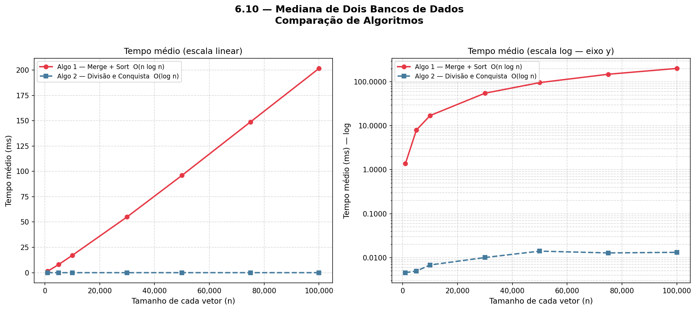

# Mediana de Dois Bancos de Dados

Implementação e benchmark de duas abordagens para calcular a mediana combinada
de duas listas ordenadas.

Descrição rápida
- Problema: dados dois vetores ordenados, calcular a mediana da união dos elementos.
- Algoritmos comparados:
  - `median_merge_sort` — juntar e ordenar (complexidade O(n log n)).
  - `median_divide_and_conquer` — divisão e conquista / busca binária (complexidade O(log min(m,n))).

Estrutura do projeto
```
projeto/
├── algorithms/        # Implementações dos algoritmos
├── benchmark/         # Runner e gerador de dados
├── tests/             # Casos de teste (pytest)
├── plot_results.py    # Gera e salva o gráfico comparativo
├── main.py            # Entrada simples para executar o plot/benchmark
├── requirements.txt
└── README.md
```

Como usar
1. Instale dependências:
```bash
python -m pip install -r requirements.txt
```
2. Executar o benchmark e gerar o gráfico:
```bash
python main.py
```
O gráfico é salvo em `outputs/median_benchmark.png`.

Testes
```bash
python -m pytest -q
```

Notas
- Os tamanhos testados pelo benchmark estão configurados entre 10^3 e 10^5 em `benchmark/runner.py`.
- `plot_results.py` chama o runner para obter os tempos médios e plota em escala linear e log.

## Discussão dos Resultados

- **Interpretação:** O gráfico `outputs/median_benchmark.png` mostra a comparação entre as duas abordagens. Em entradas grandes observa-se que `median_divide_and_conquer` cresce muito mais lentamente que `median_merge_sort` (que apresenta comportamento compatível com O(n log n)), enquanto o algoritmo de divisão e conquista tem comportamento próximo ao previsto teoricamente (dependendo de constantes e do tamanho relativo dos vetores).
- **Overheads e limitações:** Para tamanhos pequenos o custo de chamadas, cópias e constantes de implementação podem fazer com que o método de juntar+ordenar seja competitivo. Experimentos devem mencionar a máquina usada, versão do Python e número de repetições.
- **Configuração usada neste repositório:** `REPEATS = 10` (ver `benchmark/runner.py` ou `plot_results.py`), tamanhos testados em `plot_results.py` (por padrão 1_000 a 100_000) e gráfico salvo em `outputs/median_benchmark.png`.



## Como reproduzir

1. Instale dependências:
```bash
python -m pip install -r requirements.txt
```
2. Execute o benchmark e gere o gráfico:
```bash
python main.py
```
O gráfico gerado será salvo em `outputs/median_benchmark.png`.